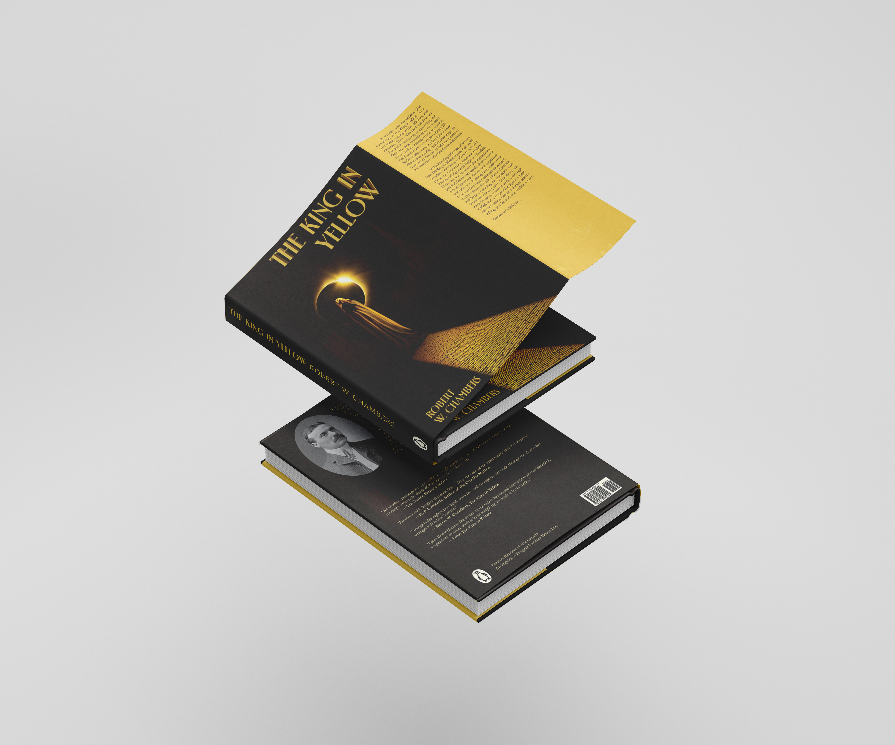
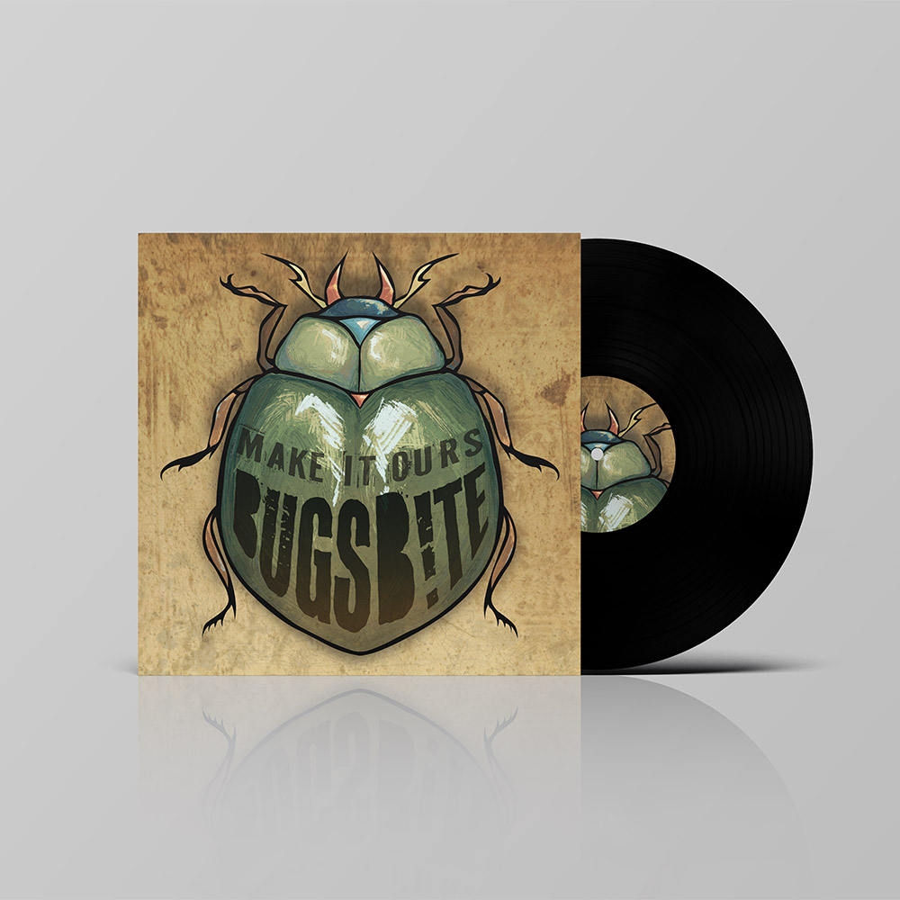
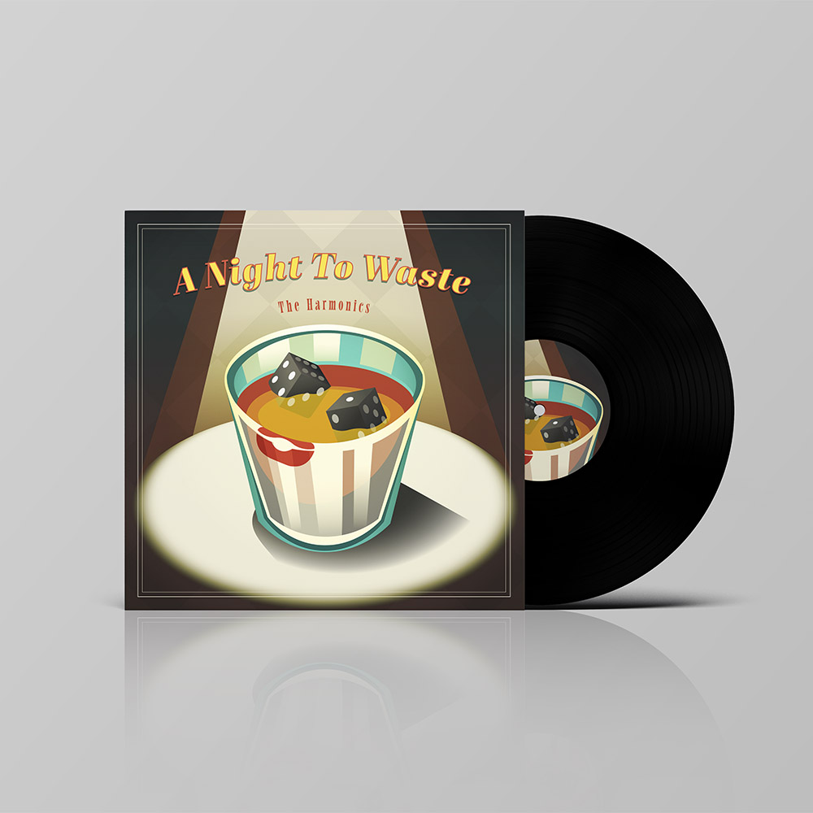

# AMY'S RESUME

## ABOUT ME
My name is Amy! I am a graphic design student who loves designing and creating art. Some of the things I enjoy to do character & world concepts, animations, designing posters, book designs, photography, storytelling (in writing and art) and much more! I am open to trying new things and being creative has always been my strongest skill.

> **RANDOM FACTS!**
> - I love mint chocolate ship ice cream
> - My favourite savour dish is crispy fried noodles
> - One of my favourite shows is ***Steven Universe***
> - This is one song that I have been listening to: [Stop The Wedding! - by Ashe](https://youtu.be/DLV8FpyxZPQ?si=sgjYv0kCmcFiRVNo)

### OBJECTIVES
Creative Graphic Design student with experience in Illustration, branding, and visual communication seeking a retail position in a creative and team-oriented environment. Skilled in communication, organization, and customer interaction with a strong passion for art, design, and visual presentation. 

**CREATIVE SKILLS**
- Traditional and digital illustration
- Creative Storytelling
- Concept Designing
- Branding, layout, and visual design
- Adobe Creative Suite and Figma proficiency

### WORK FROM FIRST YEAR:
Here are some pieces I made as a first year graphic design student.

